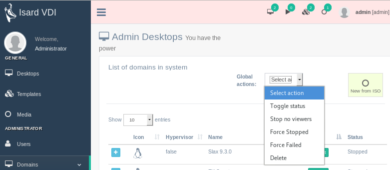

<h1>Administrar escritorios</h1>

[TOC]

# Acciones de escritorio

Hay algunas acciones que el administrador puede realizar en cada escritorio, además de iniciarlo y detenerlo:

- **Template**:Permite al administrador convertir cualquier escritorio del sistema en una plantilla compartida con otros.
- **Edit**: Es la edición genérica del escritorio del usuario pero con los límites y permisos del administrador.
- **Delete**:Se eliminará el escritorio del usuario. No se podrá recuperar.
- **XML**: Puedes ver el libvirt XML en bruto y modificarlo. Esto es práctico cuando intentamos nuevas funcionalidades.
- **Messages**:Mostrará los mensajes JSON del motor asociados a este escritorio.
- **Events**:Mostrará los eventos JSON asociados a este escritorio.

# Acciones globales

Hay un menú desplegable con una lista de acciones que se pueden realizar en un conjunto de escritorios. Los escritorios se pueden seleccionar haciendo clic sobre ellos. Si no seleccionas ningún escritorio, se llevará a una selección completa de conjuntos de escritorios, tenga cuidado:

- **Toggle status**: Esta acción cambiará el estado de *inicio* y *pausa*. Todos los escritorios seleccionados cambiarán su estado a la vez.
- **Stop no viewers**:Todos los escritorios iniciados en la selección indicaron que el sistema detectó que nadie se conectará con un visor se detendrá.
- **Force stopped**: Cualquiera que sea el estado en el que se encuentre el escritorio, se establecerá un estado de *detenido*.
- **Force failed**: Cualquiera que sea el estado en el escritorio, se establecerá un estado *fallido*.
- **Delete**: Establece el estado del escritorio seleccionado en *deleting* si está en estado detenido o fallido. Eso iniciará en segundo plano todas las acciones para la eliminación completa de los escritorios. Si algo falla en el proceso, el escritorio permanecerá en estado de error. Siempre se puede volver a activar la acción de eliminar en *deleting* los escritorios y se eliminarán de la base de datos ignorando el motor de fondo.

# Crear nuevo desde la ISO

Esta es la forma habitual de crear un nuevo escritorio completo a partir de la ISO cargada:

- **Desktop name and description**: Ponle nombre y una descripción al escritorio que estés creando.
- **Selected ISO/Floppy to boot from**:selecciona [uploaded media](media.md#upload-media) para instalar su nuevo escritorio. También tiene la opción de verificar si se trata de una ISO perteneciente a Win para instalar. Esto también agregará una segunda ISO con controladores optimizados para el Win virtual  (if the administrator already [downloaded from updates](../updates.md#recommended-updates)).
- **Select OS template**: Seleccione la plantilla que mejor se adapte a su instalación. No necesita ser la instalación exacta, solo una plantilla similar, ya que esto solo establece el hardware genérico simulado para este escritorio.
- **Adjust OS template Hardware**:Por defecto, la opción de inicio se establecerá en CD / DVD y no podrá modificarse si planea crearla a partir de una ISO descargada.

Cuando termines y haz clic en el botón **Create desktop** creará un escritorio. Ve al menú  *Desktops* para comenzar, conéctese y comience la instalación desde la ISO seleccionada.

***NOTA***:Cuando finalice la instalación del sistema operativo, generalmente el sistema operativo invitado solicitará un reinicio.  Simplemente puede apagar su sistema operativo invitado y luego [edit desktop](desktops.md#edit-desktop) para cambiar el orden de arranque de CD / DVD a DISCO DURO. También puede simplemente quitar la ISO de la sección de medios[edit desktop](desktops.md#edit-desktop)si ya no la necesita.
