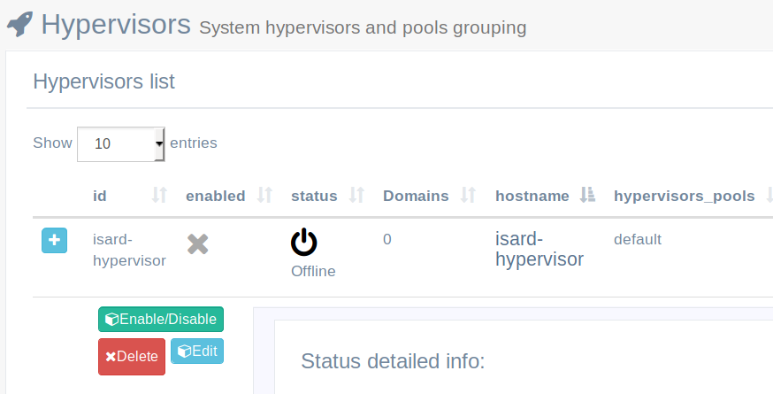
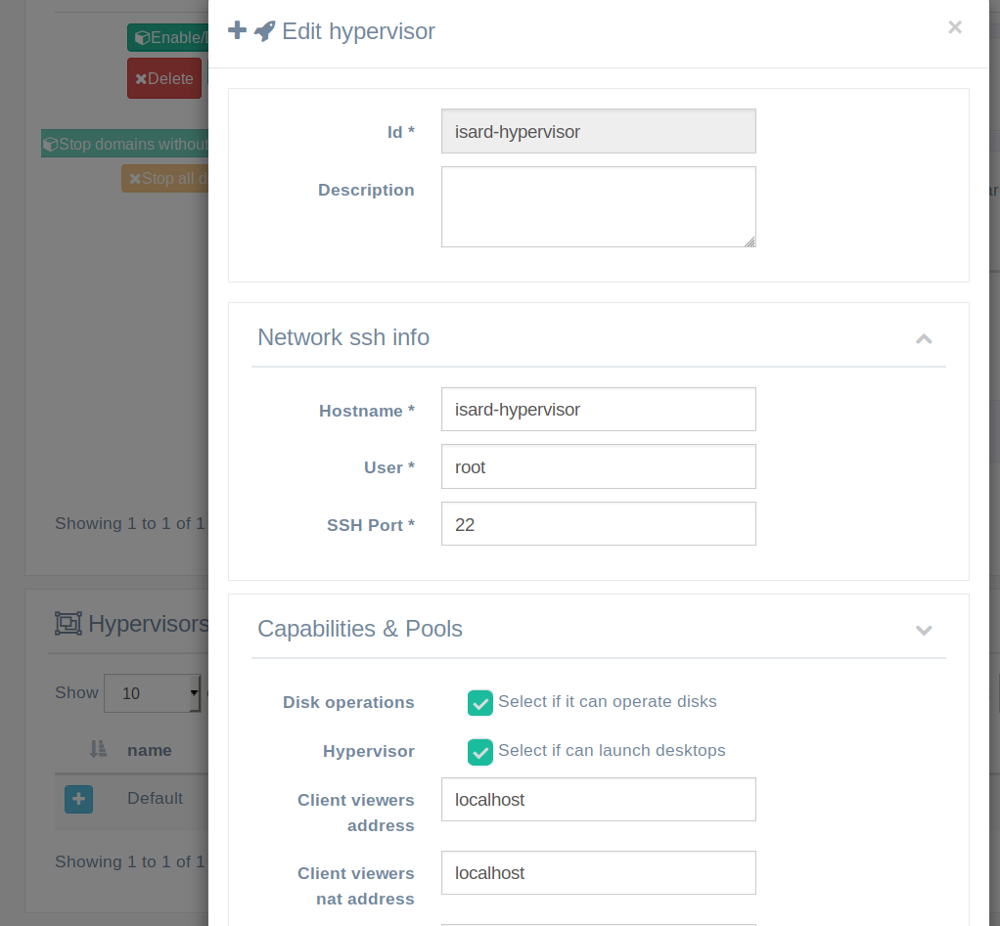

<h1>Admin FAQs & Troubleshooting</h1>

[TOC]

# Instalación

## Después de terminar de instalar isard-hypervisor predeterminado está deshabilitado

Si abre los detalles del hipervisor (haga clic en el botón +) verá los mensajes del motor IsardVDI que pueden ser útiles para determinar qué sucede. Si acaba de finalizar el asistente de instalación y el isard-hypervisor está deshabilitado, probablemente el problema sea con la de virtualización.

Su hardware necesita tener la virtualización habilitada. Puedes comprobarlo en la BIOS o también en el CLI: 
```bash
egrep '(vmx|svm)' /proc/cpuinfo
```

Si no ve nada en la salida, su CPU no tiene capacidades de virtualización o están deshabilitadas en el BIOS. Verifique que su CPU tenga esa capacidad y que no esté deshabilitada en BIOS.

También puedes verificar la capacidad dentro del contenedor en ejecución del hipervisor isard con el comando:

```bash
sudo docker exec -it isard-hypervisor virsh capabilities |grep "feature name"
```

# Visores

## Intenta conectarse a localhost o ip/hostname  incorreto

Deshabilita el isard-hypervisor en el menu Hypervisors y revisa que el visor hostname sea el correcto:

1. Deshabilita el isard-hypervisor en el menu Hypervisors
2. Editar Hypervisor (botón editar detalles)
3. Comprobar / Actualizar **doreccion de los viewers clientes**. el nombre hostname/IP donde se ejecuta el IsardVDI debe ser accesible desde los clientes.
4. Active de nuevo el hipervisor isard e inicie un nuevo dominio para verificar la conexión del visor.

### Explicación

Probablemente lo hizo usando el asistente 'localhost' o una dirección IP diferente a la que intenta conectarse ahora con los viewers. Eso llevó a que el isard-hypervisor configurado con 'localhost' o dirección IP del servidor incorrecta.

Siempre puede modificar la dirección de visualización que emplea para los clientes de edición del isard-hypervisor. Para editarlo, primero debe desactivar el isard-hypervisor haciendo clic en el botón  Enable/disable:



 habilitará el botón de edición para que pueda acceder al formulario de edición del isard-hypervisor:



Hay dos IPs de visor que se pueden configurar:

- **Client viewers address**:Esta IP/dns será la que se utiliza para los visores de su red cuando se conecten a su servidor IsardVDI. Por lo tanto, debe configurarse con la dirección IP real del servidor.
- **Client viewers nat address**: Esta dirección solo tiene sentido si planeas dar acceso a este servidor desde fuera de su organización a través de un enrutador NAT. Si este es su caso, también debe configurar aquí la dirección IP estática externa (nombre de dominio o nombre de dominio dinámico) desde donde se puede acceder.
  - The **Client viewers TCP offset** La opción está ahí para compensar el puerto predeterminado del rango de visor 5900-5949 accesible desde la red interna a otro rango desde el exterior a través del NAT. Por ejemplo, tenemos una configuración con seis hipervisores y todos son accesibles desde dentro con un rango predeterminado (5900-5949), pero configuramos reglas de NAT en nuestro enrutador externo para que cada uno de los hipervisores tenga un puerto de mapeo externo que no coincida con otros. IsardVDi intentará adivinar si el cliente se conecta desde dentro de su organización o desde fuera y configurará la dirección del visor o la dirección nat del visor en función del origen de la conexión de cada cliente.

Por lo tanto, normalmente solo tiene que modificar la **Client viewers address** y volver a activar el hipervisor.

NOTA: *Al habilitar y deshabilitar los hipervisores, se recomienda reiniciar el contenedor de la aplicación isard, ya que este proceso no es completamente confiable ahora y podría fallar. Para reiniciarlo haz:*

```bash
sudo docker-compose restart isard-app
```

Esto no afectara a las máquinas virtuales actualmente iniciadas.

## ¿Cómo puedo obtener la contraseña cuando me conecto con el cliente VNC en Win?

Abra el visor del navegador vnc y tendrá la contraseña en la url como parámetro. Cópialo para usarlo con tu cliente vnc en Win.

# Actualizaciones

## ¿Qué usuario y contraseña tienen los dominios descargados?

Todos los dominios que pueden descargarse de las actualizaciones tienen, de forma predeterminada, el usuario **isard** y la contraseña **pirineus**. El usuario isard también tiene privilegios de superusuario.

# Certificados

## No se puede acceder a Isard después de reemplazar los certificados

El nuevo certificado se utilizará para acceder a su servidor web IsardVDI ahora. Verifique que lo esté usando en su navegador (normalmente habrá un icono de casillero antes de ingresar la URL).

- En caso de que no esté utilizando los nuevos registros de certificados, verifique los registros del contenedor de archivos de nginx al abrirlo con docker-compose (sin demonizarlo con -d). Allí podrás ver información sobre el certificado que se encuentra en la carpeta.
- Verifique los certificados ahora en la carpeta predeterminada **/opt/isard/certs/default**. El código debería haber generado un ca-cert.pem (certificado de servidor extraído de fullchain). Puedes eliminar todos los certificados y colocar los nuevos y comenzar con la función docker-compose up.

En caso de que sus nuevos certificados no funcionen, se recomienda eliminar todos los certificados, volver a activar IsardVDI para que cree nuevos autofirmados e iniciar el proceso de reemplazo de certificados nuevamente (primero brind down IsardVDI).

## ¿Qué conexiones de los visores están encriptadas?

La información del certificado se mostrará en el menú  Hypervisors -> Default pool, demostrando que está en modo **Secure** y **domain info** tomando el certificado actualizado.

Puede conectarse a un escritorio en ejecución con el cliente spice y ver [[Encrypted]] en la barra de la ventana. También puede conectarse a través de vnc o spice websockets y comprobar que está utilizando el https URI con el certificado proporcionado.  Estas son las conexiones de los visores que se pueden cifrar mediante certificados:

- Spice client (visor-remoto)
- Spice websockets (navegador)
- VNC websockets (navegador)

Ten en cuenta que el cliente VNC no puede cifrar, debe usar un túnel como se describe en la sección de visores.

## Las conexiones del visor no están encriptadas.

En caso de que no esté utilizando certificados para acceder a los visores después de haber reemplazado los certificados y isardvdi servidor web lo está utilizando correctamente, debe haber un error Server-cert. PEM. IsardVDI extrae un CA-Cert. PEM del Server-cert. pem dado. Por favor, compruebe que la clave extraída CA-Cert. PEM es la correcta con:

- `openssl x509 -in /opt/isard/certs/default/ca-cert.pem -text`
- Verify that you have a full chain with your server certificate first and then your root CA chain of certificates inside server-cert (**`cat myserver.pem ca-chain.pem > server-cert.pem`**)

Si está utilizando un hipervisor externo, compruebe que ha [copiado los certificados en la carpeta correcta](hypervisors.md#add-ssh-keys-for-new-hypervisor).