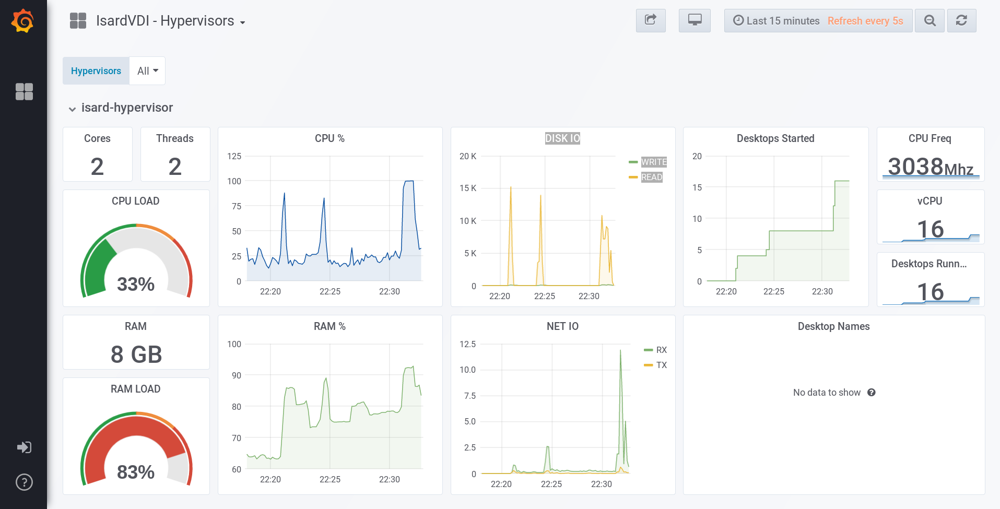

<h1>Grafana</h1>

[TOC]

# Introducción

SGrafana es un front-end web que permite mostrar dashboards con gráficos. Con este docker tendras estadísticas en tiempo real sobre IsardVDI.



# Instalación

En la carpeta `` `extras / grafana``` está el archivo docker-compose. Puedes subir la ventana acoplable grafana arrastrando de la imagen:

```
docker-compose pull
docker-compose up -d
```

O puedes crearlo

```
./build.sh <image version>
```

# Configuracion

En la interfaz Web de IsardVDI vaya al menú **config** como administrador y Active grafana. Compruebe que los parámetros son correctos (para hacer una instalación independiente del IsardVDI)

# Aceso

Conéctese al servidor IsardVDI utilizando el puerto 3000 para acceder a los paneles grafana.

Por defecto el usuario sera **admin** y su contraseña **isardvdi**.  Se recomienda encarecidamente que cambie la contraseña.

# Host grafana remoto

Puedes poner tu grafana en otro servidor pulling (o building) y ejecutando allí el yml remoto:

```
docker-compose pull
docker-compose -f remote-grafana.yml up -d
```

A continuación, debe modificar la configuración de grafana en IsardVDI **config menu** para permitir el acceso de grafana al host.