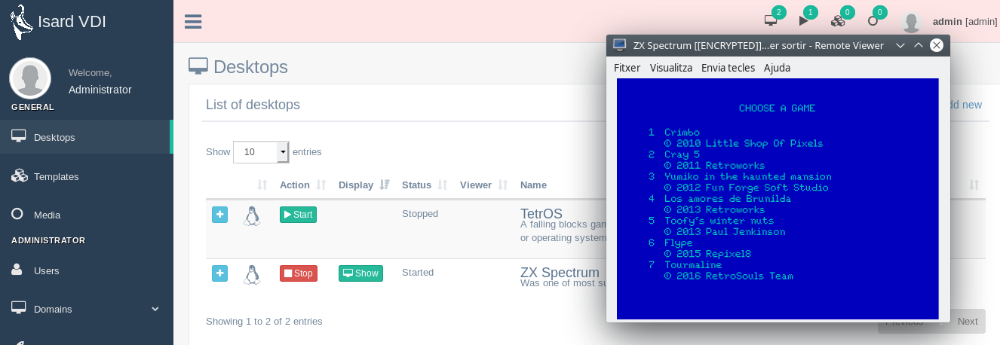
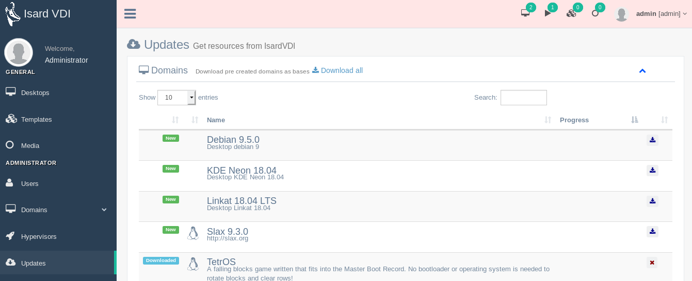
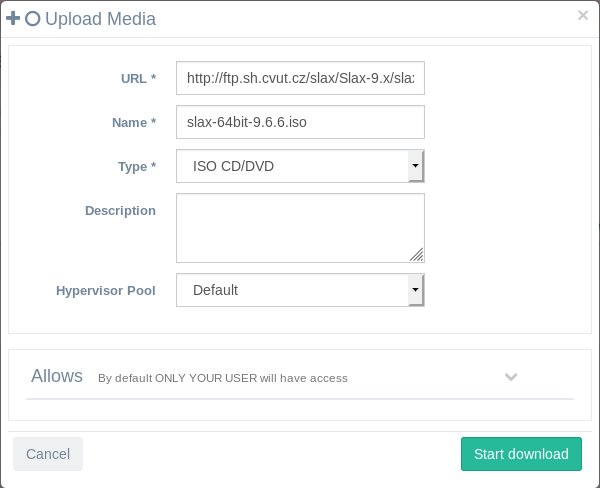
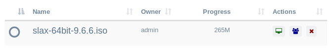
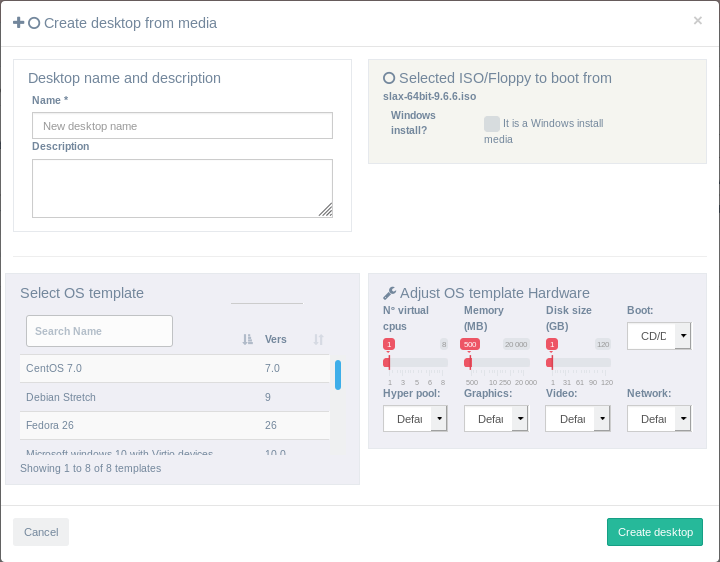
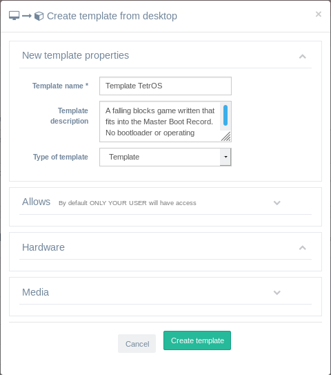

<h1>Primeros pasos</h1>

Una vez que tengas IsardVDI funcionando, podrás probar los escritorios de demostración desde actualizaciones, pero también podrás crear otros nuevos con cualquier ISO que pueda cargar. Ve al menú desktops para empezar a jugar.

[TOC]

# Demo desktops

En el menú **Desktops** encontrará dos dominios de prueba ya descargados por el asistente (si a marcado la opción para obtener escritorios de demostración).

- **TetrOS**: Un juego en el que caen bloques, escrito en el registro de arranque maestro.
¡No se necesita un gestor de arranque o sistema operativo para rotar bloques y borrar filas!
- **ZXSpectrum**: Fue una de las máquinas de 8 bits más exitosas de todos los tiempos.

Puedes iniciarlo, aparecerá un formulario modal para seleccionar el visor que deseas utilizar. Puedes probarlo con las opciones del visor del navegador (spice o vnc) sin necesidad de instalar ningún visor. Para obtener el mejor rendimiento, conéctese con el cliente spice (consulte la sección[viewer](.../user/desktops.md#connect-to-viewer))

# Actualizaciones

Desde el menú **updates** el administrador puede descargar escritorios de ejemplo (dominios) que ya hemos optimizado.

Todos los dominios que se pueden descargar des de las actualizaciones tienen por defecto el usuario **Isard** y la contraseña **Pirineus**. El usuario Isard tiene privilegios de superusuario.

# Cree su escritorio

Los administradores y los usuarios avanzados pueden crear sus propios escritorios cargando un archivo instalación ISO en media. Los administradores pueden hacer uso del menú [User Media](../user/media.md#upload-media) y también del menú [Administrator Domain Media](../admin/domains/media.md#upload-media).

Desde el menú[User Media](.../user/media.md#upload-media) haga clic en **+Agregar nuevo** y se abrirá un formulario donde podrá poner la URL de la web con la ISO que desea descargar.

Cuando a descarga termine podra crear un nuevo escritorio de arranque desde el archivo ISO haciendo clic en el icono de escritorio verde que se mostrará junto al archivo descargado.

Ahora rellena el formulario modal para crear tu escritorio.

- Rellena el campo **name** y **description** (este es opcional)
- Seleccione un **Os teplate** de la lista (puede obtener más información en el menú de updates). Debe ser lo más parecido posible al sistema que va a instalar.
- Seleccione el **hardware** que deseas que tenga el nuevo escritorio. Arrancara desde la ISO descargada, así que no modifique el arranque ISO/CD.
- Si se trata de una instalación de Win, puede marcar la casilla de verificación Win install (tiene los detalles en[Windows guest](first-steps.md#win-guest))

Después, debería ver su nuevo escritorio creado en el menú **Desktops**. Arráncalo y empezara la instalación ISO. Recuerda cambiar el arranque a disco duro cuando termine de instalarse desde los detalles del escritorio.

## cliente Linux

Simplemente [cargue un ISO](.../admin/domains/media.md#upload-media) al sistema IsardVDI usando el botón *Add new* arriba a la derecha en el menú Media. Cuando termine de subir un icono del escritorio se mostrará a la derecha del archivo subido. Ese icono de botón de escritorio abrirá un[nuevo formulario de escritorio](.../user/media.md#create-new-desktop-from-uploaded-media) que creará una instalación desde su ISO de linux.

 

Una vez que termine de instalarlo, apaga guest y ve a[editar propiedades del escritorio](.../user/desktops.md#edit-desktop) y camba el dispositivo de arranque de CD/DVD a DISCO DURO.

## cliente Win

Sigue el mismo proceso utilizado para un cliente Linux pero, para obtener el mejor rendimiento del cliente Win, tendrás que añadir algunos controladores manualmente antes de continuar con los pasos de creación:

1. Desde el menú *Uploads* descarga la ISO virtio win y espera a que termine. Esta ISO especial tiene controladores gráficos Virtio y QXL para Win.
2. Si desea cargarlo desde un ordenador local [subir una ISO Win](../user/media.md#upload-media) a IsardVDI.
archivo ISO desde servidor a Isard VDI. [iniciar un servidor web simple](../user/media.md#uploading-media-from-local-storage).
3. Ahora ve a crear un nuevo escritorio desde el botón de icono de escritorio junto a su ISO descargado y rellene [nuevo formulario de escritorio](../user/media.md#create-new-desktop-from-uploaded-media). Asegúrese de marcar  *this is a win install iso* y selecciona la plantilla de hardware apropiada de acuerdo con la versión Win que se está instalando.

Durante la instalación, tendrá los archivos ISO de CD/DVD disponibles y los controladores de VirtIO. Esto le permitirá agregar controladores de VirtIO Storage durante la instalación y obtener el máximo rendimiento.

Once you finish installing it remember to install inside Win guest all the other drivers contained in Virtio Drivers ISO. After that you can remove all the ISOs from your desktop by [editing desktop properties](../user/desktops.md#edit-desktop) and change boot device from CD/DVD to HARD DISK.

Una vez que finalice la instalación, recuerda instalar dentro de Win guest todos los demás controladores incluidos en Virtio Drivers ISO. Después puede quitar todas las ISOs desde el escritorio en [editing desktop properties](../user/desktops.md#edit-desktop) y cambiar el dispositivo de arranque desde la unidad de CD/DVD a disco duro.

# Creación de plantillas

Uno de los puntos fuertes de IsardVDI es la creación rápida y el uso compartido de plantillas. Su sistema de plantillas ha sido optimizado para ser lo más rápido posible. Tendrá su plantilla lista para ser compartida en unos pocos segundos.

Cuando haya terminado de instalar y configurar el escritorio, apagarlo correctamente. **Compruebe dos veces que no dejó ninguna información personal en el sistema (es decir, navegador) ya que se compartirá como lo es con otros usuarios del sistema!!**

Abre los detalles del escritorio y encontraras el botón **Template it** que abrirá un formulario modal para rellenar la información de la plantilla.

Cuando cree la plantilla, la encontrará en el menú **Plantillas**.  Esta plantilla no seguirá enlazada a su escritorio, por lo que puede seguir usando su escritorio, y nada cambiará en la plantilla creada.

Puedes crearlo como un tipo *Template* o un tipo *Base*. La única diferencia es la ruta base donde se almacenará en el disco.

Ahora puedes crear tantos escritorios idénticos a esa plantilla como desees. Y también a los usuarios de su sistema, en cuestión de segundos!

