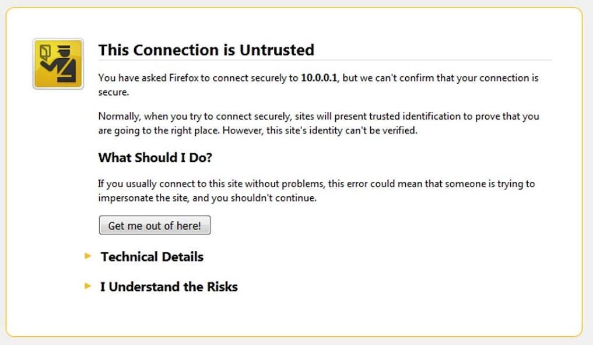
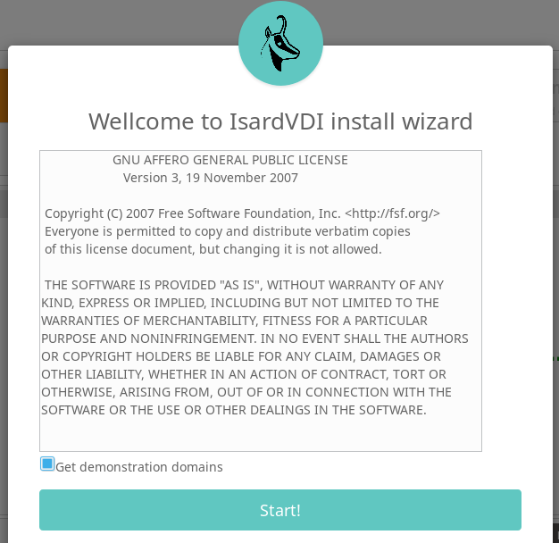
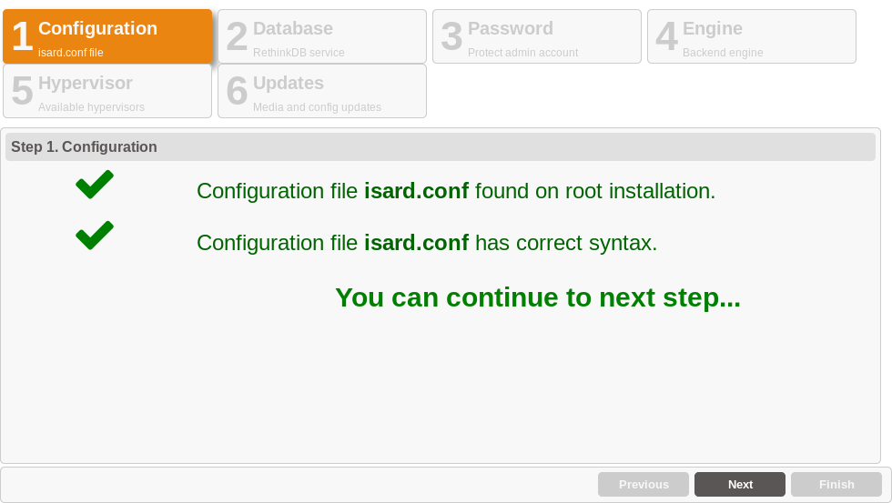
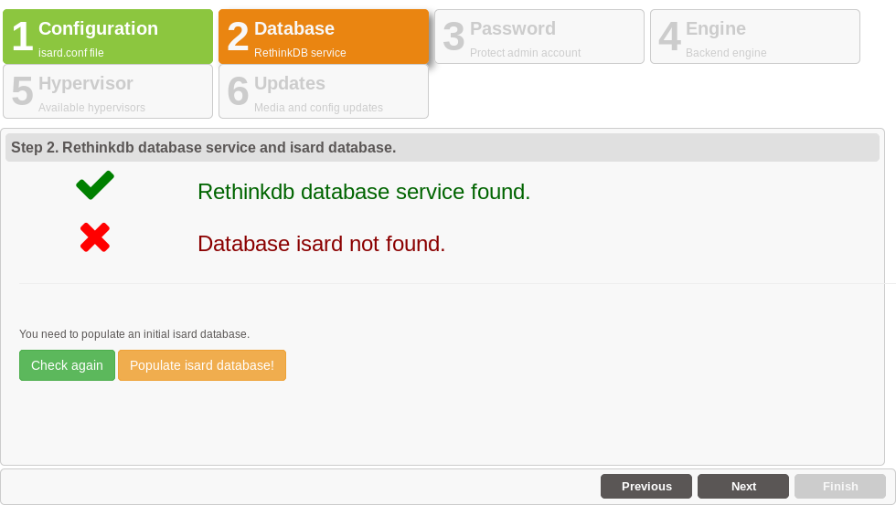
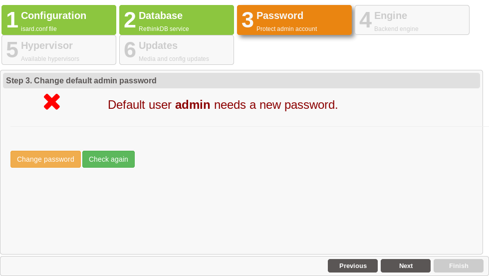
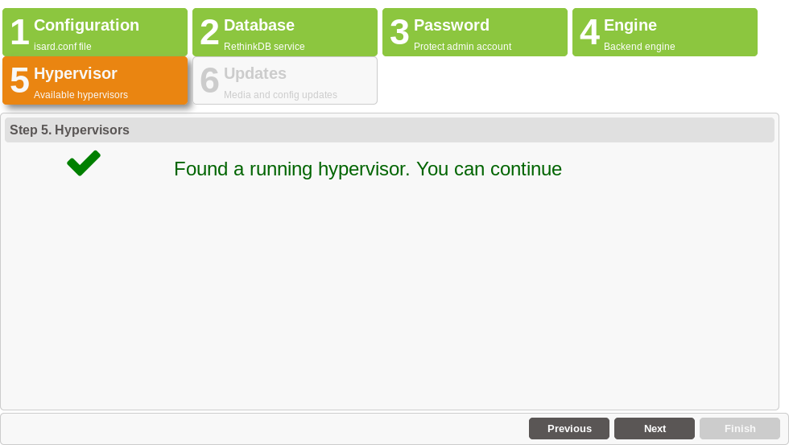
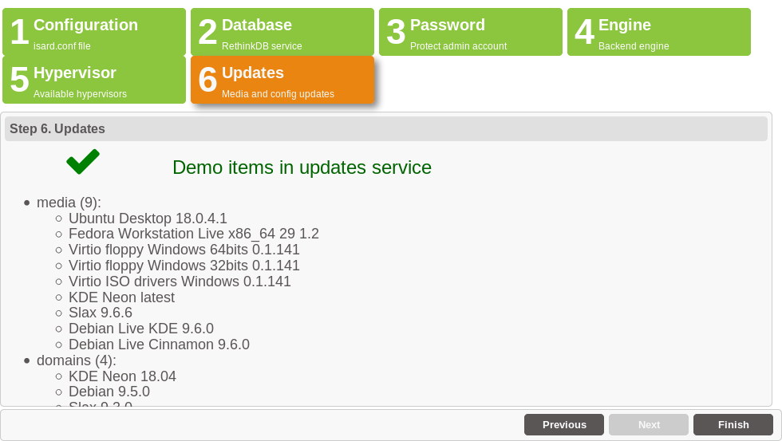
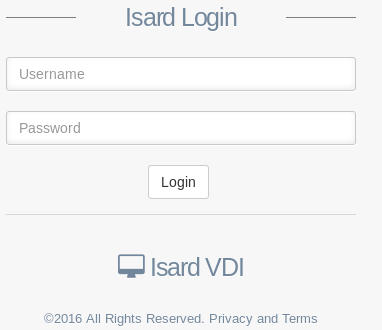

<h1>Asistente</h1>

[TOC]

# Pasos

Conectate con el navegador al servidor IsardVDI en [https://<ip|dns>] (https://< ip | dns >) y siga al asistente.

El navegador pedirá que aceptes el certificado generado y autofirmado. Añade la excepción y añádelo a los certificados de confianza, se abrirá el asistente.

Al abrirse el asistente, un formulario modal mostrará el acuerdo de licencia y una casilla de verificación ya marcada por defecto que permitirá que su instalación de IsardVDI descargue automáticamente escritorios de demostración durante la asistencia.

Sigue los pasos para finalizar la configuración inicial de IsardVDI.

## 1. Configuración

El asistente detectará la configuración automáticamente desde **isard.conf.docker**. No  cambiara nada aquí.

Haz clic en el botón **Next**.

## 2. Base de datos

La base de datos debe rellenarse ahora. Haga clic en el botón **rellenar base de datos** y espera hasta que finalice.

Cuando termine de rellenar la base de datos haz clic en el botón **Next**.

## 3. Password

El asistente te obligar a crear una nueva contraseña para el usuario **admin**. Haz clic en **Change password** y escribala dos veces. Luego haga clic en el botón **Update** para cerrar el formulario de actualización de contraseña.

Cuando cuando se haya actualizado la contraseña haz clic en el botón **Next**.

## 4. Hipervisor

IsardVDI viene con un hipervisor KVM acoplado y a continuación el asistente comprobará si está en línea.

Haga clic en el botón **Next** ya que debería estar funcionando.

## 5. Motor

El asistente comprobara que el motor de IsardVDI esté funcionando en segundo plano. Si falla, deja que transcurran unos segundos y haga clic en el botón **Check again**. Cuando encuentre el motor en funcionamiento, continuará con el siguiente paso.

Haga clic en el botón **Next** si ya ha encontrado el motor.

## 6. Actualizaciones

Si marcaste la casilla de registro en el primer modal, se mostrará una lista de recursos en línea disponibles para ser descargados. Puede registrarse más tarde desde el menú de actualizaciones.

Haga clic en el botón **Finish** y espere a que aparezca la página principal de inicio de sesión de IsardVDI. Inicie sesión con el nombre de usuario **admin** y la contraseña que proporcionó en el paso 3.

Ir ahora a[primeros pasos](first-steps.md)