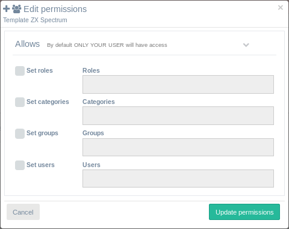
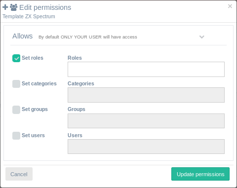
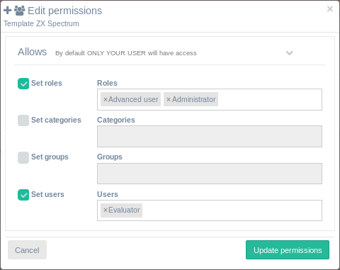

<h1>Allows</h1>

Este formulario le dará al usuario la capacidad de compartir recursos con otros roles, categorías, grupos y usuarios

[TOC]

# Understanding permissions

Hay una clasificación jerárquica de los usuarios basados (de forma descendente):

1. ROLES
2. CATEGORIAS
3. GRUPOS
4. USUARIOS

Esta clasificación establecerá el acceso a la aplicación web de IsardVDI (roles) y también su[quota](quotas.md) (categorías, grupos y usuarios). También establecerá dónde se almacenarán los recursos de usuario en el servidor:

​	`...<role>/<category>/<group>/<username>/...`

## Roles

El rol define principalmente a que tendrán acceso esos usuarios dentro de la aplicación web de IsardVDI:

| ROLES            | ACCESO DE USUARIO | Acceso Admin |
| ---------------- | ----------------- | ------------ |
| Administrators   | TODO              | TODO         |
| Advanced Users   | TODO              | NINGUNO      |
| Users            | SOLO ESCRITORIOS  | NINGUNO      |

## Categories ad Groups

Éstas son sólo clasificaciones de usuarios que les fijarán sus[cuotas](quotas.md). Por defecto os usuarios perteneceran a la categoría **Local**.

## Users

Por supuesto que está el User. Se pueden configurar diferentes[cuotas](quotas.md) para cada User si es necesario.

# Allows Form

Los usuarios pueden compartir plantillas y medios con otras personas a través de este formulario. Por defecto no se dará acceso a nadie (no se comprueba nada).

- **NO ONE ALLOWED** (predeterminado): no se comprueba nada. Esto significa que no se debe hacer coincidir ningún rol, categoría, grupo y usuario. Solo el propietario obtendrá acceso.

- **EVERYONE ALLOWED**: Si marca (y activa) cualquier rol, categoría, grupo o usuario pero no agrega ninguno en la casilla de búsqueda, coincidirá con cualqiera.

- **SOME ALLOWED**: Para permitir sólo un determinado rol, categoría, grupo o usuario, marque su casilla de verificación y búsquela en la casilla de búsqueda al lado. Tenga en cuenta que si deja el cuadro de búsqueda vacío, todos tendrán acceso a esa plantilla o media.

