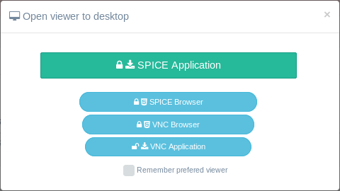
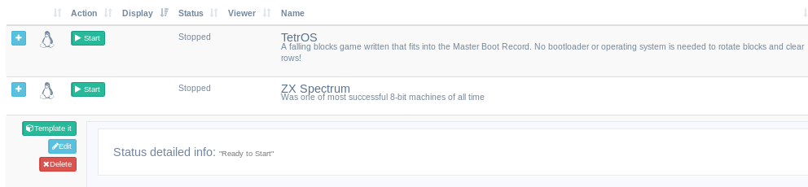
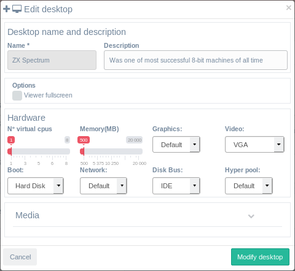
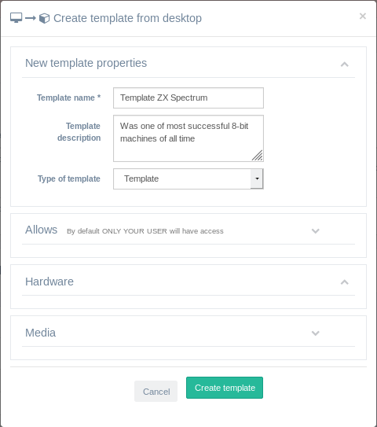

<h1>Escritorios</h1>

El menú de escritorios te permitirá gestionar tus propios escritorios.

[TOC]

# Añadir nuevo escritorio

Tiene un botón en la esquina superior derecha que abrirá un formulario modal donde puede elegir una plantilla de escritorio como una base para su nuevo escritorio y establecer el hardware dentro de sus límites de usuario [cuota] (cuotas.MD).

Nota: Si no hay plantillas para elegir, tendrá que [crear una desde un escritorio existente](desktops.md#convert-to-template) o [crear una nueva instalándolo desde una ISO](media.md#create-new-desktop-from-uploaded-media).

Debe rellenar el formulario y hacer clic en create desktop:

- **Name**: Rellene el nombre del escritorio.
- **Description**: Introduzca una descripción (opcional)
- **Search an select template**:Encuentre una plantilla utilizando el cuadro de búsqueda que filtrará la lista de plantillas y haga clic en la plantilla de la cual desee crear su escritorio.
- **Set hardware**: Después de seleccionar una plantilla se le mostrará un botón que abre una selección de hardware podrá elegir para su nuevo escritorio, siempre dentro de los límites de su usuario[quota](quotas.md).

Después de crear el escritorio, lo encontrará en estado detenido con un botón verde para iniciarlo. Si lo inicia, se mostrará un formulario de visor modal donde podrá elegir su tipo de conexión.

## Conectarse a un visor

La primera vez que inicie un escritorio, se le presentará un formulario de selección de visores con todos los tipos de conexiones disponibles en su escritorio:

| TIPO DE CONEXIÓN                                 | **CLIENTE NECESARIO**                                            | **SEGURO** |
| ----------------------------------------------- | ------------------------------------------------------------ | ---------- |
| **Cliente Spice** <u>(CLIENTE PREFERIDO)</u> | **Linux**: virt-viewer (basado en debian), remote-viewer (basado en RH)  **Win**: [virt-viewer](https://virt-manager.org/download/sources/virt-viewer) **Mac**: No se ha comprobado el funcionamiento de ningún cliente **Android**: [aSpice viewer](https://play.google.com/store/apps/details?id=com.iiordanov.freeaSPICE) **iOS**: [FlexVDI](https://itunes.apple.com/us/app/flexvdi-client/id1051361263) | SI        |
| **Navegador spice**                               | Cualquier navegador moderno: Firefox, Chromium, ...                   | SI      |
| **Navegador VNC**                                 | Cualquier navegador moderno: Firefox, Chromium, ...                   | SI        |
| **Cliente VNC**                                  | **Linux**: vinagre -F console.vv  **Win**: [RealPlayer](https://www.realvnc.com/en/connect/download/viewer/linux/) ***1** **Mac**: El cliente predeterminado de VNC trabaja en Mac **Android**: No probado **iOS**: No probado | NO***2**   |

***1**: Al abrir el archivo en RealPlayer, se le pedirá la contraseña. Puede copiar y pegar la contraseña des de los detalles del escritorio.

***2**: Las conexiones VNC en KVM a través de un cliente VNC no están siendo encriptadas. Para conectarse de forma segura con VNC se debe utilizar un túnel encriptado previamente creado o una conexión VPN.

# Detalles del escritorio

Al hacer clic en el signo **+** a la izquierda de cada escritorio, se abrirá una vista de detalles. Allí encontrará acciones y información sobre el hardware del escritorio que se está utilizando y información sobre el estado del sistema.

## Editar escritorio

Cuando el estado del escritorio se detenga, podrá editarlos en el formulario de edición que se abrirá

- **Description**: Esto es opcional y se puede actualizar.
- **Options**:
  - Viewer fullscreen: Si está marcado, establecerá ese parametro en los archivos del visor del cliente para que se abra automáticamente el invitado en pantalla completa.
- **Hardware**:Aquí puede modificar el hardware, redes y arranque para ese escritorio dentro de [cuota](cuotas.md) y [alloweds](permite.md) para el usuario.
- **Media**:Aquí puedes añadir o eliminar imágenes ISO y floppy ya cargadas en el sistema y compartidas con su usuario, grupo, categoría o rol.

Cuando termine y haga clic en el botón **Modify desktop** el motor IsardVDI llevará un montón de operaciones a cabo para asegurarse de que la nueva configuración del escritorio puede ser iniciada en el sistema. Si termina en un estado de *Fail*  debe revise las modificaciones.

## Eliminar escritorio

Cuando pare el escritorio, podra eliminarlo. Esta acción le pedirá confirmación, ya que es **no REVERSIBLE**. Y perderás todo lo relacionado con ese escritorio.

## Crear plantilla

Cuando un escritorio está parado encontraras en sus detalles (haciendo clic en el botón de la izquierda) el botón  **Template it**. Es el formulario para crear una plantilla, le pedirá cierta información:

- **Name**: Asigna un nombre para que los usuarios lo busquen paara crear un nuevo escritorio a partir de esa plantilla.
- **Description**: Opcional, pero dará a los usuarios información.
- **Kind**: Solo los roles de administrador verán esta opción que permite elegir dónde se guardara la nueva plantilla, ya sea en la carpeta bases o en la carpeta Templates.
- **Allows**: Si abre la sección [alloweds](allows.md#allows-form) podrá decidir con qué roles, categorías, grupos y usuarios individuales desea compartir esta plantilla. De forma predeterminada, todas las opciones están desactivadas, Si agrega un rol completo, nadie verá esta plantilla salvo ese rol. Lo mismo con grupos y usuarios.
- **Hardware**: Ahora puede establecer el hardware predeterminado que necesitará esta plantilla. Los usuarios podrán modificar ese hardware al crear sus escritorios basados en esta plantilla, pero dentro de su [quota](quotas.md).

Al hacer clic en el botón de crear plantilla se producen dos acciones principales:

1. el disco ded escritorio se moverá a la nueva plantilla eliminando así su escritorio actual.
2.Un nuevo escritorio de la nueva plantilla se creará idéntico al que tenía antes de crear la plantilla. Todos los cambios que realice a partir de ahora en ese escritorio ya no están vincuados a la plantilla.

Ahora todos los usuarios a los que compartas esta plantilla podrán crear un escritorio idéntico a esa plantilla.

**<u>ALERT</u>**: <u>El proceso de creación de una plantilla creará una copia exacta del escritorio de origen. Esto significa que cualquier cosa que haya guardado en ese escritorio también se replicará en esa plantilla, y los usuarios que crean escritorios a partir de esa plantilla tendrán una copia exacta de ese escritorio. Comprueba dos veces antes de crear una plantilla que los navegadores no guardado en caché sus cuentas de correo electrónico y que no ha guardado ninguna información personal en el escritorio.</u>