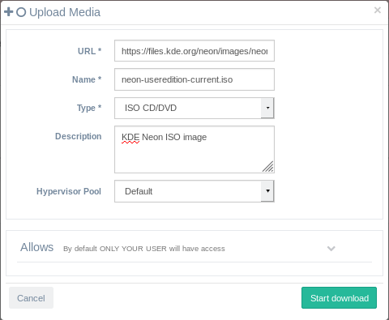
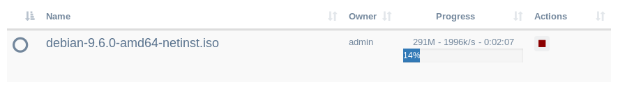
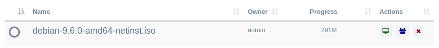
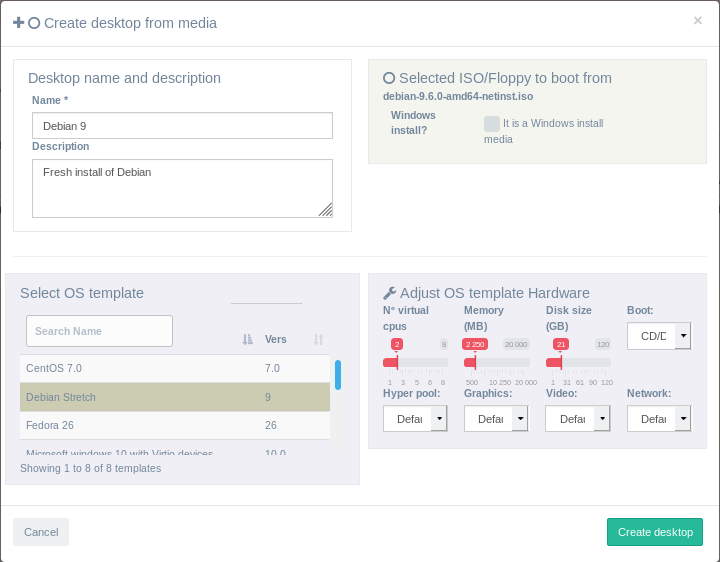
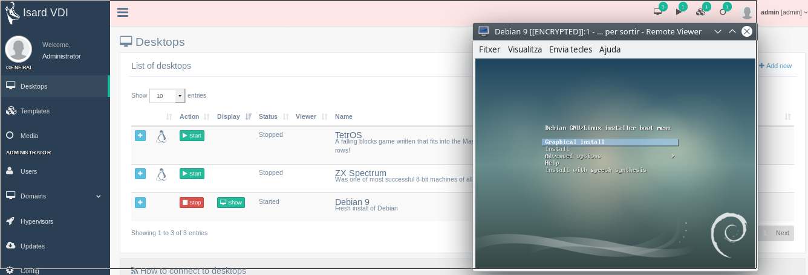

<h1>Media</h1>

Desde el administrador de medios, puede cargar imágenes ISO que le permitirán crear nuevos escritorios que arrancaran desde la ISO.

[TOC]

# Subir media

Hay un botón **Agregar nuevo** que abrirá un nuevo formulario para que IsardVDI descargue archivo desde una URL:



- **URL**: Pegue aquí cualquier URL de descarga de archivos ISO o disquete. (Los Disquete se pueden usar para agregar controladores de almacenamiento mientras se instalan algunos OSs en el disco duro).
- **NAME**: Propondrá por defecto el nombre del archivo descargado de la URL. Cámbialo si prefiere otro.
- **TYPE**: Selecciona el tipo de archivo que se está cargando (ISO/CDROM o Disquete)
- **DESCRIPTION**: Opcional
- **ALLOWS**: Funciones, categorías, grupos y usuarios permitidos para utilizar este archivos. Por favor, consulta [allows form](allows.md#allows-form).

Cuando haga clic en el botón **Upload**, se iniciará y verá el progreso.



## Carga de archivos desde el almacenamiento local

Si tienes un archivo ISo local puedes subrilo a IsardVDI, crea un servidor web con la url del archivo, y podras descargarlo des de IsardVDI.

**Ejemplo de servidor Web Python**

Si tienes un archivo *mycdrom.ISO* en una carpeta, puedes iniciar un servidor Web Python:

```
$ ls .
mycdrom.iso
$ python -m SimpleHTTPServer
Serving HTTP on 0.0.0.0 port 8000 ...
```

La dirección URL para descargar mycdrom.iso en IsardVDI upload media será **http://localhost:8000/mycdrom.iso**

# Crear un nuevo escritorio a partir de archivos cargados

Esta es la forma habitual de crear un nuevo escritorio completo a partir de una ISO subida. Verá un icono de escritorio verde junto a la carga terminada.



Al hacer clic en él, se mostrará un formulario de escritorio:



- **Desktop name and description**: Rellene el nombre y la descripción del escritorio que está creando.
- **Selected ISO/Floppy to boot from**: tienes la opción de comprobar si se trata de una propiedad ISO de Win. Esto también agregará una segunda ISO con controladores optimizados para virtual Win (si el administrador ya ha las descargado de las actualizaciones).
- **Select OS template**: Selecciona la plantilla que mejor se adapte a la instalación. No necesita ser exacta para la instalacion, sólo una similar, ya que esto sólo establecerá el hardware genérico simulado para este escritorio.
- **Adjust OS template Hardware**: You can set the hardware within your user quota. By default the boot option will be set to CD/DVD and may not be modified if you are planning to create it from

Cuando termine, haga clic en el botón **Create Desktop** se creará un escritorio. Vaya al menú *Desktops* menú para comenzar, conéctese a él y comience la instalación desde la ISO seleccionada.



***Nota***:  Cuando termine la instalación del sistema operativo por lo general que el SO invitado solicitará un reinicio. Puedes simplemente apagar el sistema operativo invitado y luego [Edit Desktop] (desktops.md#edit-desktop) para cambiar el orden de arranque de CD/DVD al disco duro. También puede quitar el ISO de la sección de medios  [edit desktop](desktops.md#edit-desktop) si ya no es necesario.

## Crea un escritorio de arranque de red (PXE)


Puedes cargar cualquier archivo ISO (puede ser un archivo falso que termina con .ISO creado con Touch por ejemplo) y luego seguir el proceso de [creating new desktop from uploaded media](media.md#create-new-desktop-from-uploaded-media) pero seleccionando PXE en la de selección de arranque en lugar de CD/DVD.

