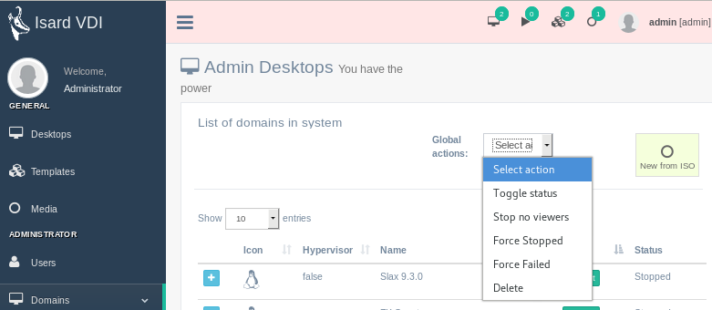

<h1>Administer Desktops</h1>

[TOC]

# Desktop actions

There are some actions that administrator can perform on each desktop, besides of start and stopping it:

- **Template**: Lets the admin convert any desktop in the system to a template shared to others.
- **Edit**: It is the generic desktop edit that also has the desktop user owner but now with the limits and permissions of the administrator.
- **Delete**: Will delete user desktop. Not recoverable.
- **XML**: You can view raw libvirt XML and modify it. This is practical whe trying new functionalities.
- **Messages**: It will show the raw bunch of engine JSON messages associated with this desktop.
- **Events**: It iwll show the raw bunch of engine JSON events associated with this desktop. 

# Global actions

There is a dropdown with a list of actions that can be performed on a set of desktops. Desktops can be selected clicking over them. Not selecting any desktop will lead to a whole desktop set selection, be carefull:

- **Toggle status**: This action will toggle *start* and *stopped* status. All the desktops selected will switch their status at once.
- **Stop no viewers**: All the desktops started in the selection set that the system detected that no one is connected with a viewer will be stopped.
- **Force stopped**: Whatever state has the desktop a *stopped* state will be set.
- **Force failed**: Whatever state has the desktop a *failed* state will be set.
- **Delete**: It will set all the selected desktop status to *deleting* if it is in stopped or failed status. That will initiate in background engine all the actions to reach complete deletion of desktops. If anything fails in that process the desktop will remain in a Failed state. You can always trigger delete action again on *deleting* desktops and they will be deleted from database ignoring the background engine.

# Create new from ISO

This is the usual way of creating a complete new desktop from your uploaded ISO:

- **Desktop name and description**: Fill the name and description for the new desktop being created.
- **Selected ISO/Floppy to boot from**: Select an already [uploaded media](media.md#upload-media) to install your new desktop. You have also the option to check if it is a Win proprietary ISO to install. This will also add a second ISO with optimized drivers for virtual Win (if the administrator already [downloaded from updates](../updates.md#recommended-updates)).
- **Select OS template**: Select the template that better suits your installation. It doesn't need to be the exact install, just a similar template as this will only set the generic hardware simulated for this desktop.
- **Adjust OS template Hardware**: By default the boot option will be set to CD/DVD and may not be modified if you are planning to create it from downloaded ISO.

When you finish and click in **Create desktop** button a desktop will be created. Go to *Desktops* menu to start, connect to it and begin installation from selected ISO.

***NOTE***: When you finish the OS installation usually that guest OS will request for a reboot. You may just shutdown your guest OS and then [edit desktop](desktops.md#edit-desktop) to change boot order from CD/DVD to HARD DISK. Also you may just remove the ISO from the [edit desktop](desktops.md#edit-desktop) media section if not needed anymore.
