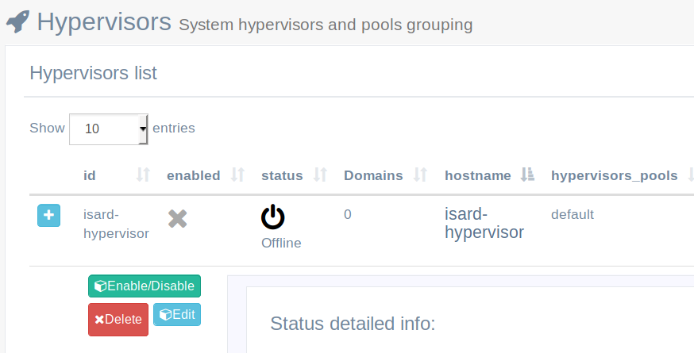
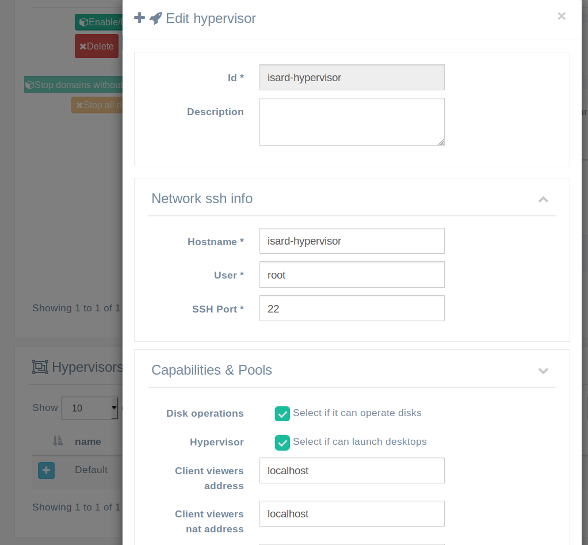

<h1>Admin FAQs & Troubleshooting</h1>

[TOC]

# Installation

## After finishing install the default isard-hypervisor is disabled

If you open de hypervisor details (click on + button) you will see messages from IsardVDI engine that can be useful to determine what happened. If you just finished install wizard and isard-hypervisor is disabled probably the problem is with virtualization capabilites.

Your hardware needs to have virtualization enabled. You can check that in your BIOS but also from CLI:

```bash
egrep ‘(vmx|svm)’ /proc/cpuinfo
```

If you see nothing in the output your CPU has no virtualization capabilites or they are disabled in BIOS. Please verify that your CPU has that capability and that it is not disabled in BIOS.

You may also check for that capability inside de isard hypervisor running container by issuing the command:

```bash
sudo docker exec -it isard-hypervisor virsh capabilities |grep "feature name"
```

# Viewers

## Tries to connect to localhost or incorrect IP/hostname

Disable isard-hypervisor in Hypervisors menu and check that viewer hostname is correct:

1. Disable isard-hypervisor in Hypervisor menu
2. Edit Hypervisor (details edit button)
3. Check/Update **Client viewers address**. Should be the hostname/IP where IsardVDI is running and must be accessible from clients.
4. Enable isard-hypervisor again and start new domain to check viewer connection.

### Explanation

Probably you did the wizard using 'localhost' or an IP address different to the one you are trying to connect now with viewers. That lead to an isard-hypervisor set up with 'localhost' or that wrong server IP address.

You can always modify the viewer address used for clients editing the isard-hypervisor. To edit it you must first disable isard-hypervisor by clicking in Enable/disable button:



 and then the edit button will be enabled so you can access the isard-hypervisor edit form:



There are two viewer IPs that can be set:

- **Client viewers address**: This IP/dns will be the one used in viewers from your network connecting to your IsardVDI server. So it should be set up to the real IP address of your server.
- **Client viewers nat address**: This address only makes sense if you are planning to give access to this server from outside your organization through a NAT router. If this is your case then you must also set here the external static IP address (or domain name or dynamic domain name) from where it could be reached. 
  - The **Client viewers TCP offset** option is there to offset the default 5900-5949 viewer range port accessible from internal network to another range from outside through the NAT. For example we have a set up with six hypervisors and all of them are accessible from inside with default range (5900-5949) but we set up NAT rules in our external router so each of the hypervisors have an external mapping port that not collides with others. IsardVDi will try to guess the client from connecting from inside your organization or from outside and will set up viewer address or viewer nat address depending on each origin client connecting.

So, usually you only have to modify the **Client viewers address** and enable the hypervisor again. 

NOTE: *When enabling and disabling hypervisors it is recommended to restart isard-app container as this process is not completely reliable now and could fail. To restart it do:*

```bash
sudo docker-compose restart isard-app
```

This does not affect to currently started virtual machines.

## How can I get the password when connecting with VNC client in Win?

Open the vnc browser viewer and you'll have the password in the url as a parameter. Copy it to use it with your vnc client in Win.

# Updates

## Which user and password do the downloaded domains have?

All domains that can be downloaded from updates have by default the user **isard** and the password **pirineus**. The isard user has also superuser privileges.

# Certificates

## Can't access Isard after replacing certificates

The new certificate will be used to access your IsardVDI webserver now. Verify that it is using it in your browser (usually there will be a locker icon before url input).

- In case it is not using new certificate check nginx isard container logs while bringing it up with docker-compose up (withouth daemonizing it with -d). There you will see information about the cert found in folder. 
- Check the certificates now in default folder **/opt/isard/certs/default**. Code should have generated a ca-cert.pem (server certificate extracted from fullchain). You may remove all certificates, put new ones again and start it with docker-compose up.

In case your new certificates didn't work it is recommended to remove all the certificates, bring IsardVDI up again so it will create new self-signed ones, and start the process of replacing certificates again (first brind down IsardVDI).

## Which viewer connections are encrypted?

Certificate info will be shown at menu Hypervisors -> Default pool, showing that it is in **Secure** mode and the **domain info** taken from the updated cert. 

You may connect to a running desktop with spice client and see [[Encrypted]] in window bar. Also connect through vnc or spice websockets and check that it is using https URI with the provided certificate. These are the viewer connections that can be encrypted using certs:

- Spice client (remote-viewer)
- Spice websockets (browser)
- VNC websockets (browser)

Note that VNC client can't be encrypted and should use a tunnel as described in viewers section.

## Viewer connections are not encrypted

In case it is not using certificates to access viewers after you replaced certificates and IsardVDI webserver is using it correctly, there must be a server-cert.pem error. IsardVDI extracts a ca-cert.pem from the given server-cert.pem. Please check that extracted ca-cert.pem key is the correct one with:

- `openssl x509 -in /opt/isard/certs/default/ca-cert.pem -text`
- Verify that you have a full chain with your server certificate first and then your root CA chain of certificates inside server-cert (**`cat myserver.pem ca-chain.pem > server-cert.pem`**)

If you are using an external hypervisor check that you have [copied the certificates in the correct folder](hypervisors.md#add-ssh-keys-for-new-hypervisor).