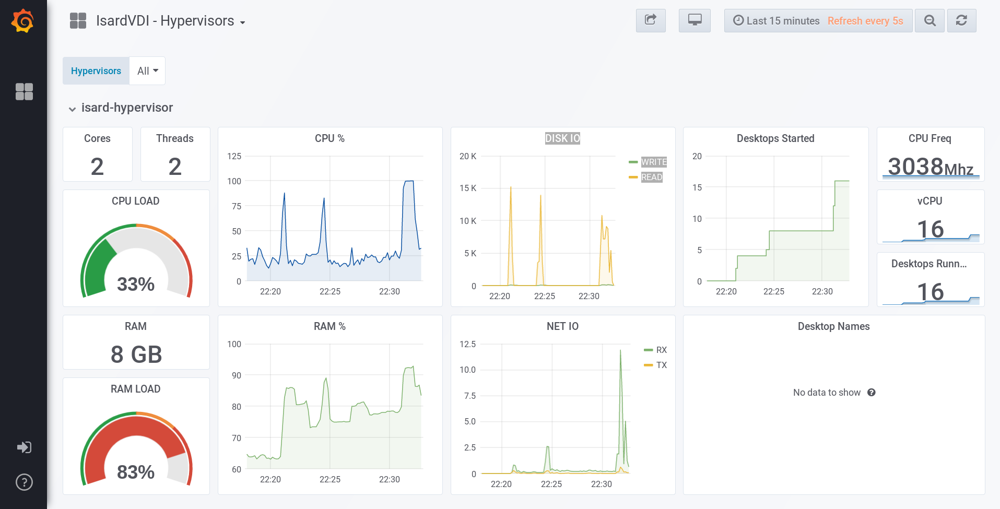

<h1>Grafana</h1>

[TOC]

# Introduction

SGrafana is a web frontend that allows showing dashboards with graphs. With this docker you will have statistics in real time about your IsardVDI.



# Installation

In the ```extras/grafana``` folder there is the docker-compsose file. You can bring the grafana docker up by pulling the image:

```
docker-compose pull
docker-compose up -d
```

Or you can build it

```
./build.sh <image version>
```

# Configuration

In your IsardVDI web interface, as an admin, go to **config menu** and activate grafana. Check that the parameters are correct (for an stand alone installation of IsardVDI it should be)

# Access

Connect to your IsardVDI server on port 3000 to access grafana dashboards. 

Default user is **admin** and password **isardvdi**. It is highly recommended that you change that default password.

# Remote grafana host

You can put your grafana in another server by pulling (or building) and running there the remote yml:

```
docker-compose pull
docker-compose -f remote-grafana.yml up -d
```

You should then modify grafana settings in IsardVDI **config menu** to allow access to this remote grafana host.