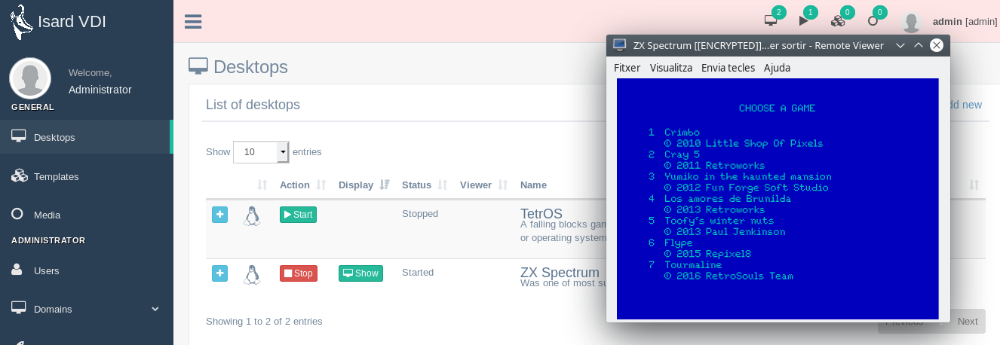

<h1>First steps</h1>

Once you have IsardVDI working you will be able to test demo desktops from updates, but also create new ones with any ISO you can upload. Go to dektops menu to start playing.

[TOC]

# Demo desktops

In your **Desktops** menu you will find two test domains already downloaded during the wizard (if you checked to get demo desktops).

- **TetrOS**: A falling blocks game written that fits into the Master Boot Record. No bootloader or operating system is needed to rotate blocks and clear rows!
- **ZXSpectrum**: Was one of most successful 8-bit machines of all time.

You can start it and a modal form will show up to select the viewer you want to use. You can try it with browser viewer options (spice or vnc) without installing any viewer. For best performance connect with spice client (refer to [viewer section](../user/desktops.md#connect-to-viewer))

# Updates

From **updates** menu administrator can download example desktops (domains) that we have already optimized.

All domains that can be downloaded from updates have by default the user **isard** and the password **pirineus**. The isard user has also superuser privileges.

# Create your desktop

Administrators and Advanced Users are able to create their own desktops by uploading an ISO install file to Media. Administrators can make use of [User Media](../user/media.md#upload-media) menu and also [Administrator Domain Media](../admin/domains/media.md#upload-media) menu.

From the [User Media](../user/media.md#upload-media) menu click on **+Add new** button and a modal form will open where you can put the web URL with the ISO you want to download.

When it finished downloading you will be able to create a new desktop booting from this ISO file clicking in the green desktop icon that will be shown beside the downloaded file.

Now fill in the modal form to create your desktop.

- Fill in the **name** and optional **description**
- Select an **Os teplate** from the list (you can get more from updates menu). It should be as similar as possible to the system you are going to install.
- Select all the **hardware** you want your new desktop to have. You are going to boot from the downloaded ISO, so do not modify the ISO/CD boot.
- If it is a Win install you may check the Win install checkbox (you have details in [Windows guest](first-steps.md#win-guest))

After that you should see your new created desktop in the **Desktops** menu. Start it and your ISO install should come up. Remember to change boot to hard disk when you finish installing it from the desktop details.

## Linux guest

Just [upload an ISO](../admin/domains/media.md#upload-media)  to IsardVDI system using the *Add new* top right button in Media menu. When it finishes uploading a desktop icon will be shown to the right of the uploaded file. That desktop button icon will open a [new desktop form](../user/media.md#create-new-desktop-from-uploaded-media)  that will create an install from your linux ISO.

Once you finish installing it, shutdown guest and go to [edit desktop properties](../user/desktops.md#edit-desktop) and change boot device from CD/DVD to HARD DISK.

## Win guest

Follow the same process used for a Linux Guest but, for best Win guest performance, you will need to add some drivers manually before starting the creation steps:

1. From *Uploads* menu download the virtio win ISO and wait till it finishes. This special ISO has Virtio and QXL graphics drivers for Win.
2. [upload a Win ISO](../user/media.md#upload-media)  to IsardVDI . If you want to upload it from a local computer [start a simple webserver](../user/media.md#uploading-media-from-local-storage) to serve your ISO fle an upload to IsardVDI.
3. Now go to create a new desktop from the desktop icon button next to your media downloaded iso and fill [new desktop form](../user/media.md#create-new-desktop-from-uploaded-media). Be sure to tick *this is a win install iso* checkbox and select appropiate hardware template according to the Win version being installed.

During installation you will have both cd/dvd ISO files available, your Win install and the Virtio Drivers. That will allow you to add Virtio Storage drivers during install and get maximum performance.

Once you finish installing it remember to install inside Win guest all the other drivers contained in Virtio Drivers ISO. After that you can remove all the ISOs from your desktop by [editing desktop properties](../user/desktops.md#edit-desktop) and change boot device from CD/DVD to HARD DISK.

# Template creation

One of the strengths of IsardVDI is the quick creation and sharing of templates. It's template system has been optimized to be as quick as possible. You will have your template ready to be shared within a few seconds.

When you finished installing and configuring your desktop, shut it down correctly. **Check twice that you didn't let any personal information in the system (i.e. browser) as it will be shared as it is with other system users!!**

Open the desktop details and you will find a **Template it** button that will open a modal form to fill the template information.

When you create the template you will find it in **Templates** menu. This template will not follow anymore your desktop, so you can continue using your desktop but nothing will change in the created template.

You can create it as a *Template* type or a *Base* type one. The only difference is the base path where it will be stored in disk.

You can create now as many desktops identical to that template as you want! And also your system users, within seconds!

