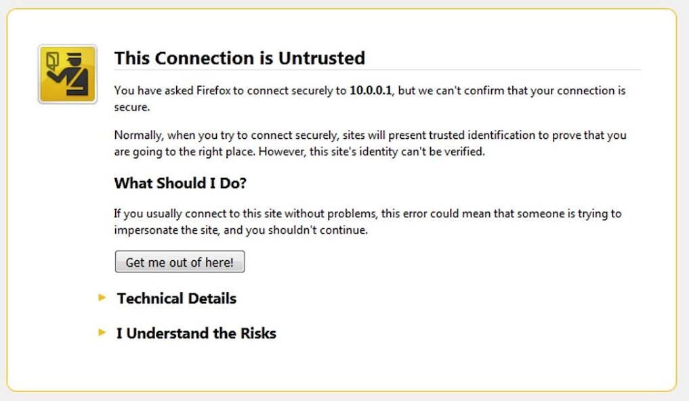
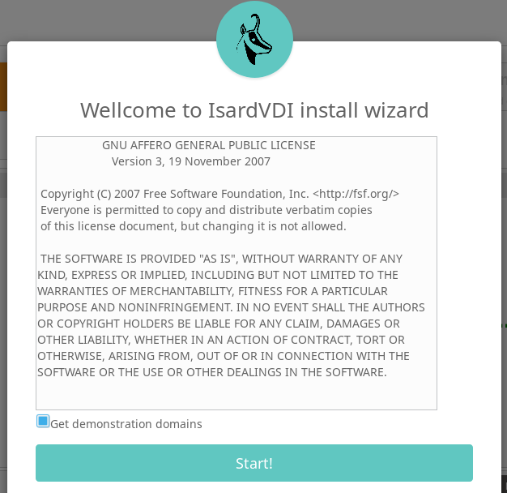
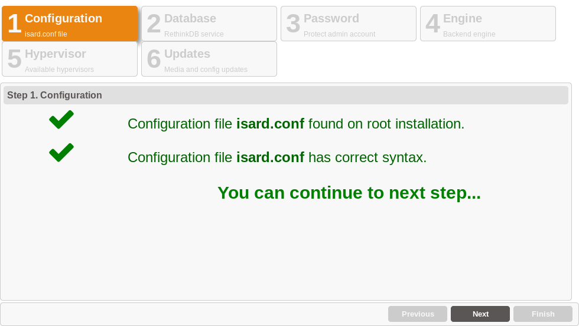
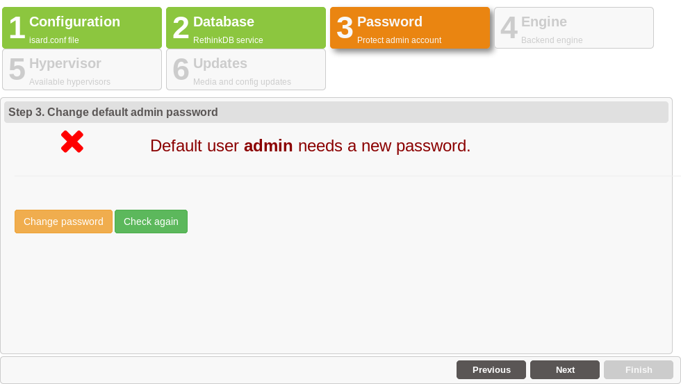
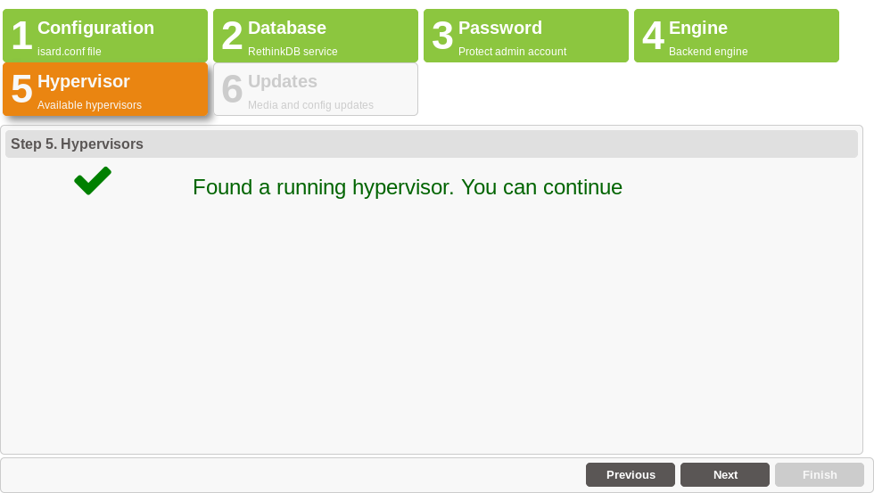
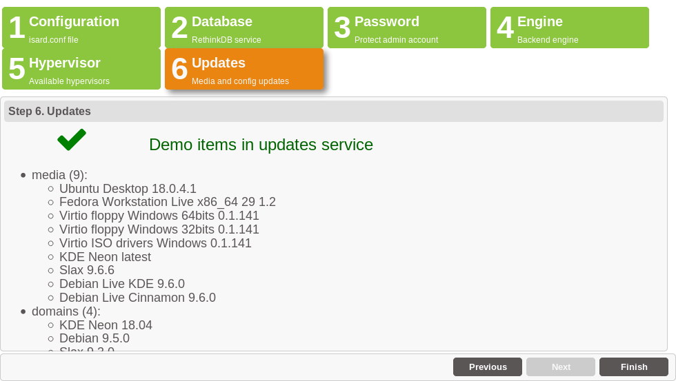
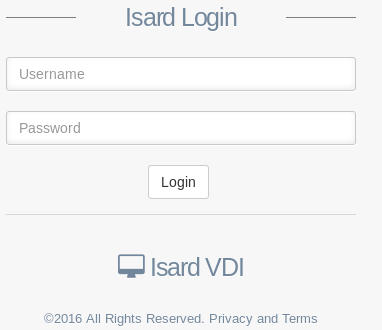

<h1>Wizard</h1>

[TOC]

# Steps

Connect with your browser to your IsardVDI server on [https://<ip|dns>](https://<ip|dns>) and follow wizard.

The browser will ask to to accept the self-signed generated certificate. Add an exception and add the certificate to trusted certificates and it will open the wizard.

As the wizard opens a modal form will show license agreement and a checkbox already checked by default that will allow your IsardVDI installation to automatically download demo desktops during the wizard.

Follow steps to finish your IsardVDI initial configuration.

## 1. Configuration

Wizard will detect configuration automatically from **isard.conf.docker**. Nothing may be changed here.

Click on **Next** button.

## 2. Database

Database must be populated now. Click on **Populate database** button and wait till it finishes.

Click on **Next** button when it finishes database populate.

## 3. Password

Wizard forces to set up a new **admin** user password. Click on **Change password** button and fill it twice. Click on **Update** button to close password update form.

Click on **Next** button when password has been updated.

## 4. Hypervisor

IsardVDI comes with a dockerized KVM hypervisor and now the wizard will check if it is online.

Click on **Next** button as it should be up and running already.

## 5. Engine

Wizard checks for IsardVDI engine to be running in background. If it fails, let some seconds to be up and click on **Check again** button. When it finds the running engine it will continue to next step.

Click on **Next** button if already found the engine.

## 6. Updates

If you checked the register checkbox in the first modal it will show a list of resources online available to be downloaded. You can register later from updates menu.

Click on **Finish** button and wait for the main login IsardVDI page to come up. Login with **admin** username and the password you provided in step 3.

Go now to [first steps](first-steps.md)