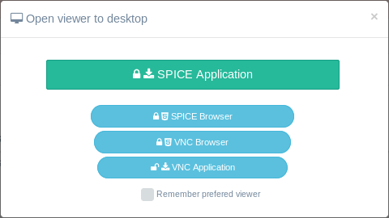
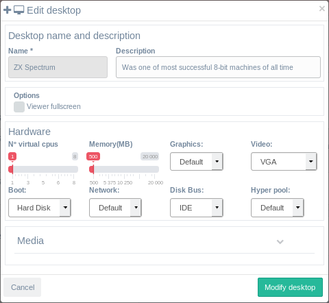
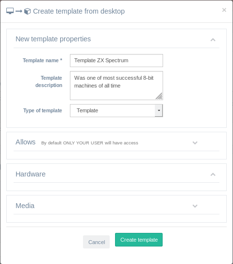

<h1>Desktops</h1>

Desktops menú will allow you to manage your own desktops.

[TOC]

# Add new desktop

You have a button on the top right corner that will open a modal form where you can choose a template desktop as a base for your new desktop and set the hardware within your user [quota](quotas.md) limits.

NOTE: If there are no templates to choose from you will need to [create one from an existing desktop](desktops.md#convert-to-template) or [create new one installing it from a downloaded media ISO](media.md#create-new-desktop-from-uploaded-media).

You shoul fill the form an click on create desktop:

- **Name**: Fill in your desired desktop name
- **Description**: Give it a description (optional)
- **Search an select template**: Find a template using the search input box provided that will filter template table list and click on the template you want to create your desktop from.
- **Set hardware**: After selecting a template you will be shown with a button that opens a selection of hardware that you can choose for your new desktop, always within your user [quota](quotas.md) limits.

After creating the desktop you will find it in stopped status with a green button to start it. If you start it, a modal viewer form will be shown where you can choose your connection type.

## Connect to viewer

The first time you start a desktop you will be presented with a viewer selection form with all available types of connections to your desktop:

| CONNECTION TYPE                                 | **CLIENT NEEDED**                                            | **SECURE** |
| ----------------------------------------------- | ------------------------------------------------------------ | ---------- |
| **Spice client** <u>(PREFERRED CLIENT)</u> | **Linux**: virt-viewer (debian based), remote-viewer (RH based)  **Win**: [virt-viewer](https://virt-manager.org/download/sources/virt-viewer) **Mac**: No client tested to be working **Android**: [aSpice viewer](https://play.google.com/store/apps/details?id=com.iiordanov.freeaSPICE) **iOS**: [FlexVDI](https://itunes.apple.com/us/app/flexvdi-client/id1051361263) | YES        |
| **Spice browser**                               | Any modern browser: Firefox, Chromium, ...                   | YES        |
| **VNC browser**                                 | Any modern browser: Firefox, Chromium, ...                   | YES        |
| **VNC client**                                  | **Linux**: vinagre -F console.vv  **Win**: [RealPlayer](https://www.realvnc.com/en/connect/download/viewer/linux/) ***1** **Mac**: Default VNC client in Mac works **Android**: Not tested **iOS**: Not tested | NO***2**   |

***1**: When opening file in RealPlayer it will ask for password. You can copy&paste password from desktop details.

***2**: VNC connections in KVM through a VNC client are not being encrypted. To connect securely with VNC it should be used a previously created encrypted tunnel or VPN connection.

# Desktop details

When you click on the **+** sign to the left of each desktop a details view will open. There you will find actions and information about desktop hardware being used and system status information.

## Edit desktop

When desktop is stopped you will be able to edit them in the edit form that will open:

- **Description**: This is optional and can be updated.
- **Options**:
  - Viewer fullscreen: If checked it will set that paraemeter in client viewer files so it will automatically open the guest in fullscreen.
- **Hardware**: Here you can modify the hardware, networks and boot for that desktop within the [quota](quotas.md) and [alloweds](allows.md) for your user.
- **Media**: Here you can add or remove ISO and Floppy images already uploaded into the system and shared with your user, group, category or role.

When you finish and click on **Modify desktop** button a bunch of operations will be held by IsardVDI engine to ensure that the new desktop configuration can be started in the system. If it finishes in a *Fail* state you should review your modifications.

## Delete desktop

When the desktop is stopped you can delete it. This action will ask for confirmation as it is **NOT REVERSIBLE**. You will lose anything that was related to that desktop.

## Create template

When a desktop is stopped you will find in its details (clicking the + button on the left) a button to **Template it**. The form to create a template will ask for some information:

- **Name**: Give it a name that users will search for when creating a new desktop from that template.
- **Description**: Optional but will give users information about.
- **Kind**: Only admin roles will see this option that lets choose where the new template will be stores, either in bases folder or in templates folder.
- **Allows**:  If you open the [alloweds](allows.md#allows-form) section you will be able to decide which roles, categories, groups and individual users you want to share this template. That means who will be able to find this template when creating a new desktop. By default all options are unchecked, what means that no one will see this template. If you add a full role, all the categories in that role will see that template. The same with groups and users.
- **Hardware**: You can now set the default hardware that this template will need. Users will be able to modify that hardware when creating their desktops based on this template but within their [quota](quotas.md).

When you click on create template button two main actions will happen:

1. Your desktop disk will be moved to the new template thus deleting your current desktop.
2. A new desktop from the new template will be created identical to the one you had before creating the template. All the changes you do from now on to that desktop are not connected to the template anymore.

Now all the users whom you shared that template will be able to create a desktop identical to that template in the moment of the creation.

**<u>ALERT</u>**: <u>The process of creating a template will create an EXACT COPY of the source desktop. That means that whatever you have stored in that desktop will also be replicated in that template, and users that create desktops from that template WILL HAVE AN EXACT COPY of that desktop. Check twice before creating a template that the browsers inside don't cached your email accounts and that you have not stored any personal information in the desktop.</u>