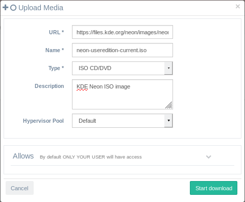
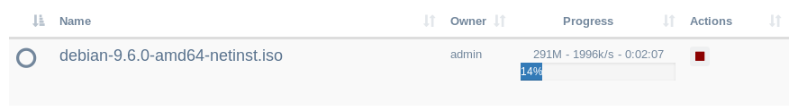
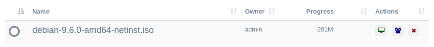
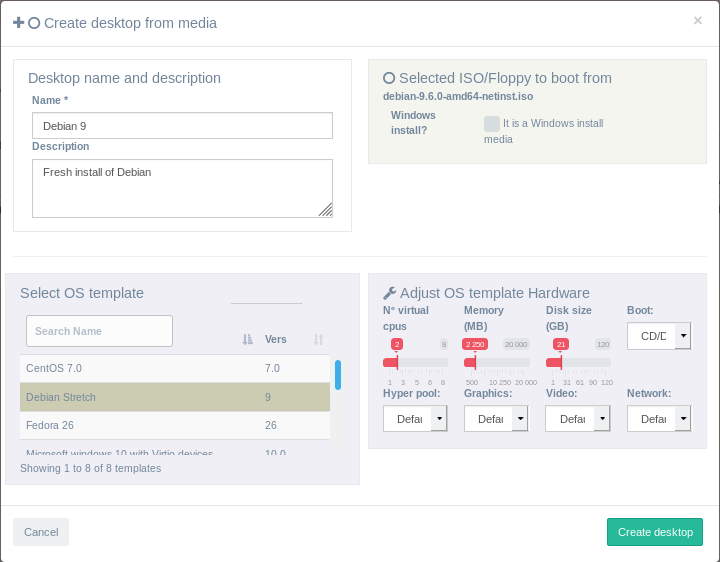
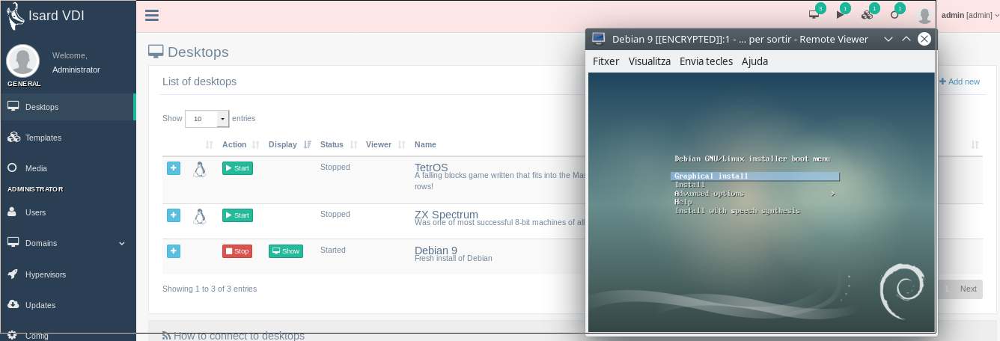

<h1>Media</h1>

From media manager you can upload ISO and floppy images that will allow you to create new desktops that boot from it.

[TOC]

# Upload media

There is an **Add new** button that will open a new form to make IsardVDI download media from an URL:



- **URL**: Paste here any ISO file download URL or floppy. (Floppies can be used to add storage drivers while installing some OSs in hard disk).
- **NAME**: It will propose by default the file name extracted from the URL. Change it if you prefer another one.
- **TYPE**: Select the type of media being uploaded (ISO/CDROM or Floppy)
- **DESCRIPTION**: Optional
- **ALLOWS**: Allowed roles, categories, groups and users to use this media. Please refer to [allows form](allows.md#allows-form).

When you click the **Upload** button it will start and you will see progress.



## Uploading media from local storage

If you have your ISO locally in your storage and you want to upload it to IsardVDI you can create a simple webserver which url to the file can be filled in the upload media form in IsardVDI.

**Python webserver example**

If you have *mycdrom.iso* file in a folder you can start a python webserver:

```
$ ls .
mycdrom.iso
$ python -m SimpleHTTPServer
Serving HTTP on 0.0.0.0 port 8000 ...
```

The URL to download mycdrom.iso in IsardVDI upload media will be **http://localhost:8000/mycdrom.iso**

# Create new desktop from uploaded media

This is the usual way of creating a complete new desktop from your uploaded ISO. You will see a green desktop icon next to the finished upload.



When you click it a new desktop form creation will be shown:



- **Desktop name and description**: Fill the name and description for the new desktop being created.
- **Selected ISO/Floppy to boot from**: You have the option to check if it is a Win proprietary ISO to install. This will also add a second ISO with optimized drivers for virtual Win (if the administrator already downloaded from updates).
- **Select OS template**: Select the template that better suits your installation. It doesn't need to be the exact install, just a similar template as this will only set the generic hardware simulated for this desktop.
- **Adjust OS template Hardware**: You can set the hardware within your user quota. By default the boot option will be set to CD/DVD and may not be modified if you are planning to create it from

When you finish and click in **Create desktop** button a desktop will be created. Go to *Desktops* menu to start, connect to it and begin installation from selected ISO.



***NOTE***: When you finish the OS installation usually that guest OS will request for a reboot. You may just shutdown your guest OS and then [edit desktop](desktops.md#edit-desktop) to change boot order from CD/DVD to HARD DISK. Also you may just remove the ISO from the [edit desktop](desktops.md#edit-desktop) media section if not needed anymore.

## Create a network boot (PXE) desktop

You can upload any ISO file (it can be a fake file ending with .iso that you created with touch for example) and then follow the process of [creating new desktop from uploaded media](media.md#create-new-desktop-from-uploaded-media) but selecting PXE in Boot select box instead of CD/DVD.

